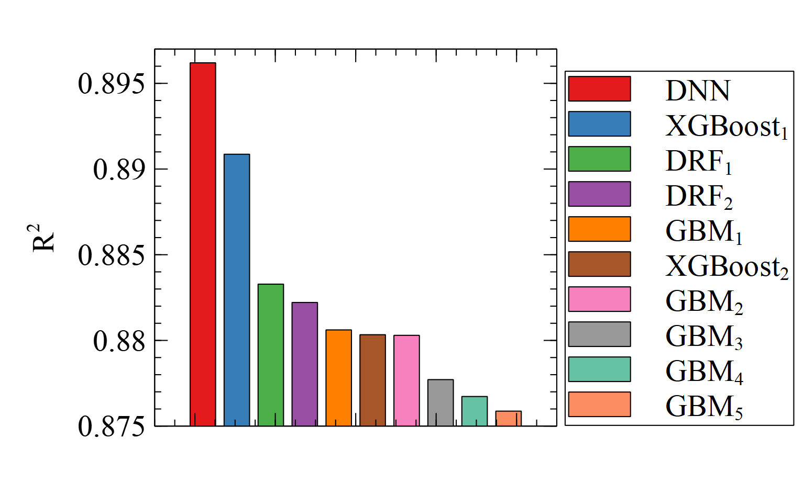

The performances of the Machine Learning (ML) Models to estimate Human-perceived Window View Openness Indexes are shown below,

Please follow the instructions of H2O AutoML to use the ML models.

https://docs.h2o.ai/h2o/latest-stable/h2o-docs/automl.html
